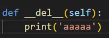
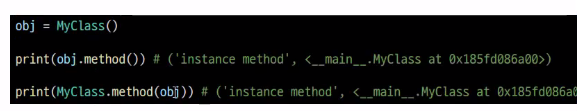
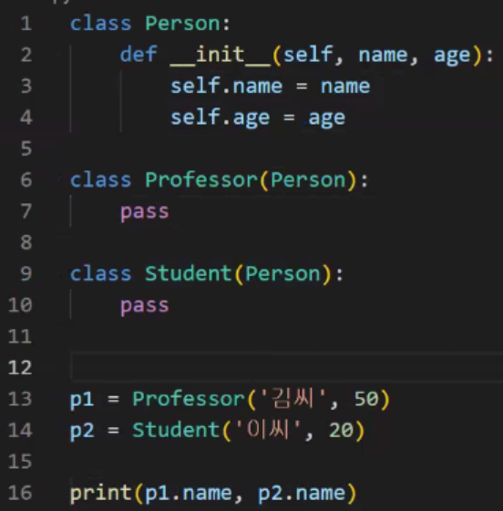
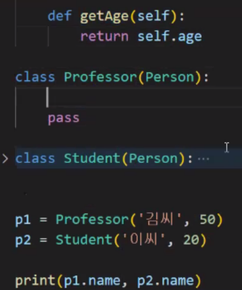
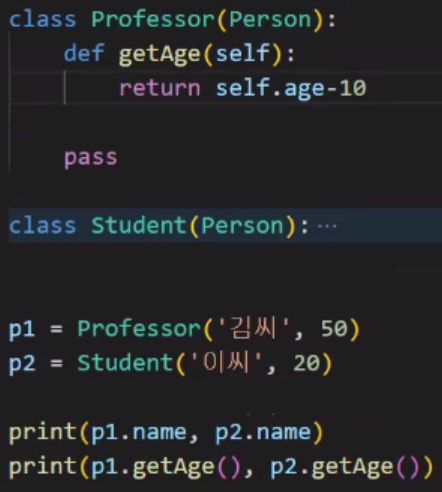
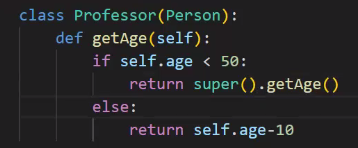
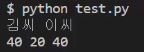

# 0727 보충

메모리에 올라간 특정 클래스의 객체 : **인스턴스**

인스턴스(객체)는 행동을 함 -> 메서드

p.31

is : id() 즉, 메모리 주소가 같은지를 확인하는 것

equal(==) : 값이 똑같은지 확인

p.39

리스트 타입 만들듯이, 내 프로그램에 필요한 타입(클래스)을 만듦

(예시)

반지름이 서로 다른 원의 면적을 각각 구한다면,,

클래스는 타입만 만든 것이고, 인스턴스를 통해 실체를 생성한다.

type(인스턴스) 출력 시 나오는 `__main__` 은 내가 만든 것이라는 의미로 보면 됨


###### [매직매소드]

> 연산자나 표준함수들(print, len)과 연관되어 있음

- `__init__` (self, r)

인스턴스 메소드 : 속성, 행동을 갖는 인스턴스가 만들어지면서, 해당 인스턴스가 갖는 메소드가 생성됨(?)

생성할때마다 갯수를 더해주고 싶다면 생성자 함수 안에 `변수 += 1` 만들기

- print() -> 객체의 타입인 클래스에 선언되어 있는 `__str__`을 호출하여 return 받은 결과를 화면에 표시한다
  
  => print 시 메모리 주소 등 예쁜 출력값이 나오지 않았을 때 

- `__str__`
  
  ```python
  def __str__(self):
      return f'반지름이 {self.r}인 원'
  ```

- `__gt__(self, other)` : 컴퓨터는 부등호를 이해하지 못하기 때문에 값을 서로 비교하고 싶을 때 해당 매직메소드 사용

- `__del__` : 소멸자 (인스턴스 지우고 싶을 때)
  
  만약 지울때마다 어떤 값을 출력하고 싶다면
  
  

=> init과 del은 클래스 명을 가지고 만드는 것이기 때문에, return을 쓰면 안됨!

###### [인스턴스 메소드]

인스턴스.메소드() 하면 결과값이 출력되어야 함

=> 첫번째 인자는 자기자신(self)를 넣어주면 됨


=> 인스턴스 메소드 내부에서 클래스 변수를 쓰고 싶으면 `클래스.변수명`

###### [클래스 메소드]

생성할 때 데코레이터 앞에 붙이고, 인자에는 self 대신 클래스 메소드이기 때문에 cls 넣어줌


p.41

원래 호출할때

`인스턴스.인스턴스메소드`,`클래스.클래스메소드` 로 호출하지만, `인스턴스.클래스메소드`도 호출은 된다! 권장하지는 않는듯

p.70

클래스가 인스턴스메소드를 부르면 : 클래스는 객체가 없기 때문에 self를 넣어줄 수 없다 -> 에러남 => 강제적으로 obj를 넣어서 결과를 반환했다 ==> 권장하지 않음!



###### [스태틱 메소드]

-> 거의 쓰지는 않을 듯

데코레이터를 쓰고, self나 cls 같은 인자는 필요 없음

#### 상속

> 객체지향 프로그램 만들때는 설계가 굉장히 중요함.
> 
> 유사한 속성과 유사한 메소드가 있을 때 일일이 만들어도 되긴 하지만, 
> 
> 중복을 줄이기 위해 상속을 이용할 수 있음 

p.80



김씨 이씨



김씨 이씨

50 20



김씨 이씨

40 20

  => 다형성, 오버라이딩, 재정의





자식클래스에서 부모클래스를 사용하고 싶을 때 super() 사용
